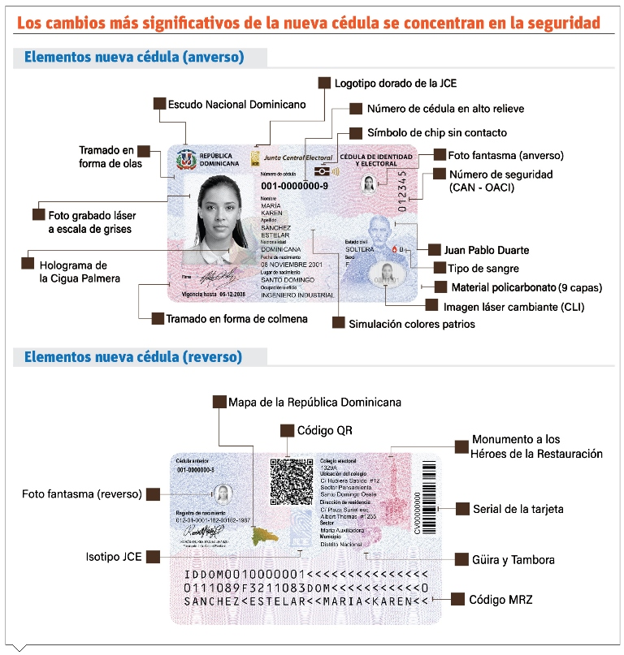
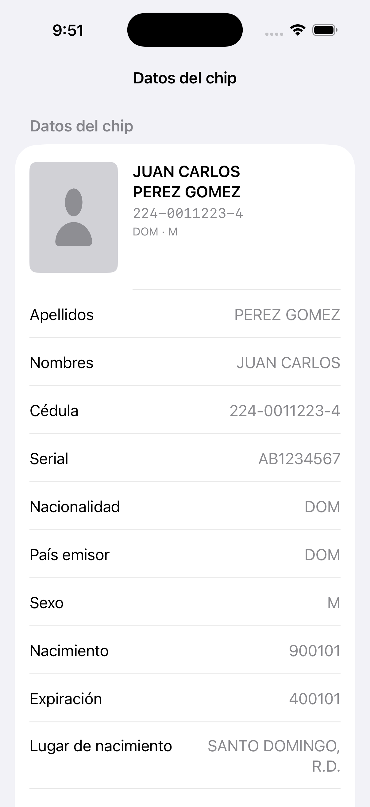
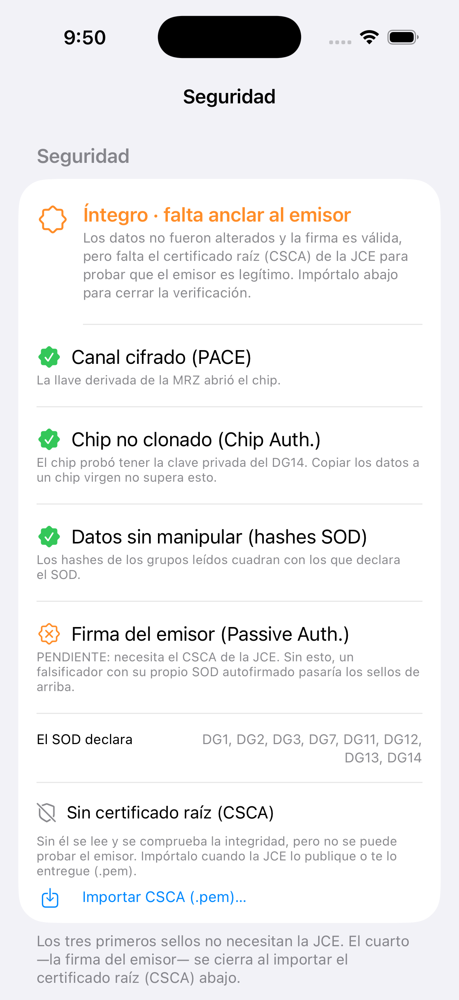
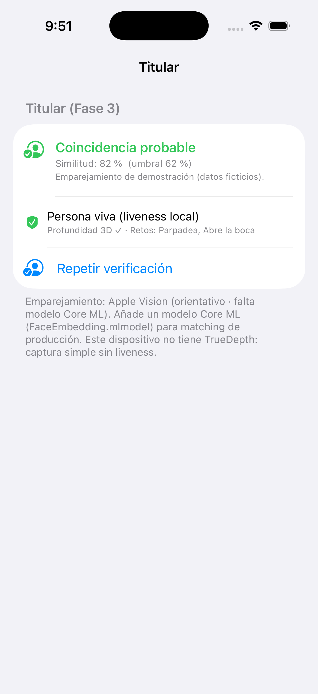
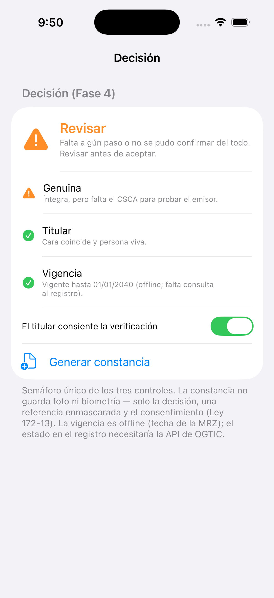

# Cédula dominicana con chip — reingeniería y validador

Documentación técnica completa de la reingeniería del chip de la **nueva cédula dominicana**
(emisión 2026) y de un **validador de identidad de cuatro fases, 100 % offline**, para iOS.

Todo lo afirmado aquí se verificó **leyendo el plástico o analizando sus volcados** — no de
documentación, que no existe públicamente. Donde una conclusión se apoya en pocas muestras o
en el flujo de trabajo, y no en la propia traza, está dicho.

> **No es una publicación de la Junta Central Electoral.** Investigación con fines de estudio,
> realizada sobre cédulas propias. Este repositorio **no contiene datos personales**: todos los
> valores de ejemplo son ficticios o genéricos.

📄 Dossier visual: `dossier.html` · 📱 Guía de la app con capturas: `docs/GUIA-APP.md`



<sub>Infografía divulgativa de la JCE / prensa · ejemplar de muestra con datos ficticios (cédula 001-0000000-9) · incluida solo como ilustración.</sub>

---

## Índice

1. [Qué es la cédula por dentro](#1-qué-es-la-cédula-por-dentro)
2. [Cómo se lee el chip](#2-cómo-se-lee-el-chip)
3. [Qué guarda el chip](#3-qué-guarda-el-chip)
4. [La cadena de confianza](#4-la-cadena-de-confianza)
5. [Cinco applets en un chip](#5-cinco-applets-en-un-chip)
6. [La firma digital](#6-la-firma-digital)
7. [El DG13 y los códigos de oficialía](#7-el-dg13-y-los-códigos-de-oficialía)
8. [Análisis forense](#8-análisis-forense)
9. [¿Es segura?](#9-es-segura)
10. [El validador de cuatro fases](#10-el-validador-de-cuatro-fases)
11. [Cómo compilar y ejecutar](#11-cómo-compilar-y-ejecutar)
12. [Método y autocrítica](#12-método-y-autocrítica)
13. [Estructura del repositorio](#13-estructura-del-repositorio)
14. [Avisos](#14-avisos)

---

## 1. Qué es la cédula por dentro

La nueva cédula es un **documento de viaje electrónico (eMRTD)** conforme a **ICAO 9303** — el
mismo estándar de los pasaportes electrónicos. Lleva un chip sin contacto (ISO 14443 / NFC).
Por eso una librería de lectura de pasaportes la lee **sin cambios**: ese fue uno de los
primeros hallazgos, y contradice la idea de que hacía falta algo a medida.

La tarjeta incluso **se autoidentifica** en sus bytes históricos: `446F6D49447631` = `DomIDv1`
("Dominican ID version 1"), lo que permite reconocerla antes de autenticar nada. Soporta
**APDUs de longitud extendida hasta 1060 bytes** y command chaining.

## 2. Cómo se lee el chip

**El acceso es por PACE, no por BAC** (la spec de partida decía "BAC, posiblemente PACE").
En concreto: `id-PACE-ECDH-GM-AES-CBC-CMAC-256` — intercambio de claves ECDH sobre curva
**secp384r1 (NIST P-384)**, cifrado **AES-256**, hash SHA-256.

**La llave no es secreta**: se deriva de la **MRZ impresa en el reverso** (formato TD1, tres
líneas de 30 caracteres) — número de documento, fecha de nacimiento y fecha de expiración.
Quien tiene la cédula puede derivarla.

**El detalle fino:** el serial del plástico tiene 10 caracteres (p. ej. `AB01234567`) y el
campo de documento de la MRZ admite 9, así que ICAO obliga a partirlo. Hay dos formas de armar
la llave, y no todas las implementaciones coinciden:

| Opción | Campo que se manda | Cuándo |
|---|---|---|
| **A** (por defecto) | serial de 10 + su dígito de control | la correcta en la cédula dominicana |
| **B** (fallback) | los 9 primeros + `<` como dígito | si A da `SW 0x63 0x00` |

La app permite alternar en caliente. **La correcta resultó ser la A.**

## 3. Qué guarda el chip

El índice firmado (SOD) declara ocho grupos de datos. Todos legibles salvo las huellas.

| Grupo | Contenido | Estado |
|---|---|---|
| DG1 | MRZ (nombre, número, nacionalidad, sexo, fechas) | legible |
| DG2 | Foto facial — **JPEG** 312×400, ~8 KB | legible |
| DG3 | Huellas dactilares | **bloqueado (EAC)** |
| DG7 | Firma manuscrita — JPEG | legible |
| DG11 | Nombre completo, lugar de nacimiento | legible |
| DG12 | Autoridad emisora, fecha de emisión | legible |
| DG13 | Datos propios de la JCE (registro civil) | legible |
| DG14 | Claves públicas para Chip Authentication | legible |

- **La foto NO es JPEG2000** (la spec decía que sí): es **JPEG** con cabecera JFIF, 312×400.
  El registro biométrico ISO 19794-5 está **casi vacío de metadatos** (género, calidad, pose,
  puntos faciales — todo a cero). Implicación para face-match: no hay puntuación de calidad y
  la imagen de referencia es de baja resolución.
- **Las huellas SÍ están en el chip** (grupo DG3), firmadas, pero protegidas por **EAC**
  (Extended Access Control): leerlas exige un certificado de terminal emitido por la JCE. Doble
  confirmación: el SOD firma un hash del DG3, y el DG14 declara el protocolo `id-TA` (Terminal
  Authentication), que es la cerradura que las protege.
- **COM** declara LDS 1.08, Unicode 4.0.0, y la misma lista de grupos que el SOD (sin grupos
  ocultos).

## 4. La cadena de confianza

La autenticidad se apoya en tres eslabones de firma. **Verificamos dos por cuenta propia**; el
tercero necesita el certificado raíz de la JCE.

```
datos ──hash──▶ SOD ──firma──▶ DSC ──firma──▶ CSCA
└─ verificado ─┘   └─ verificado ─┘   └─ necesita el CSCA de la JCE ─┘
```

- **datos → SOD (integridad):** el SHA-256 de cada grupo coincide con el hash que declara el
  SOD. Verificado a mano, **7/7, en las dos cédulas** (Passive Authentication de datos).
- **DSC → SOD (firma):** la firma del SOD es válida bajo el certificado firmante embebido
  (`CMS Verification successful`).
- **CSCA → DSC (raíz):** pendiente. El certificado raíz de la JCE **no viaja en el chip** (el
  SOD trae un solo certificado) y **no está en las master lists internacionales**: 0 de la
  República Dominicana (`C=DO`) entre 112 países y 588 CSCA de la lista alemana (BSI, mayo
  2026). Además esos directorios son de **pasaportes**; la cédula usa una raíz de identidad
  nacional propia (`CN=JCE CSCA`), que probablemente solo reparta la JCE.

Datos de la raíz y el firmante:

| Campo | Valor |
|---|---|
| Raíz (CSCA) | `CN = JCE CSCA` · SKI `E8:09:0E:B7:D5:C7:1F:FE:56:8F:06:54:A4:67:5A:F5:EA:26:4B:B8` |
| Firmantes vistos | `JCE DS 01` y `JCE DS 02` → **misma raíz** |
| Tipo de documento firmado | `"I"` (cédula), no pasaportes |
| Algoritmos | hashes SHA-256; SOD firmado ECDSA-SHA256; DSC firmado por CSCA ECDSA-SHA384 |
| Rotación del firmante | ~122 días (**cada trimestre**); clave EC de 256 bits |

Con dos cédulas se vieron **dos firmantes distintos pero la misma raíz**: con ese único CSCA
se validan ambas y todas las futuras. La JCE rota el firmante cada trimestre — el CSCA es el
único ancla estable.

## 5. Cinco applets en un chip

El catálogo de la tarjeta (`EF.DIR`) revela que no hay un applet, sino **cinco**. Los nombres
van en ASCII dentro del propio AID. La arquitectura es **idéntica entre cédulas** — la
personalización cambia los datos, no la estructura.

| Applet | AID | Función | Estado |
|---|---|---|---|
| ICAO | `A0000002471001` | eMRTD (lo que se lee) | operativo |
| DomRepEID | `D276000098446F6D4944` | raíz de la tarjeta (`3F00`) | operativo |
| CitizenID | `D276000098436974697A656E4944` | Autenticación Ciudadana (PIN) | operativo |
| SSCD | `A00000006353534344` | creación de firma cualificada | operativo (sellado) |
| ePKI | `A000000063504B43532D3135` | estructura PKCS#15 | **inicialización** |

Hallazgos por applet:

- **`DomRepEID` es la raíz de la tarjeta** (su fichero es `3F00`, el Master File): de él cuelga
  el `EF.DIR`.
- **El SSCD es una caja sellada por diseño:** responde a `SELECT` y se declara operativo, pero
  a nueve consultas `GET DATA` (incluido el CPLC del chip) responde "no soportado". No expone
  ficheros ni datos. Es exactamente cómo debe comportarse un dispositivo de creación de firma:
  no revela nada y solo firma tras autenticación.
- **El PIN de CitizenID:** hay **dos referencias** (`01` y `02`). La tarjeta **oculta el
  contador de intentos** — responde `6300` en vez del `63CX` estándar. Eso hace que sondear el
  PIN sea inseguro (no se puede confirmar que un intento no descuente), y es un diseño
  defensivo deliberado. **Este proyecto nunca envía el PIN.**
- **La estructura PKCS#15 (ePKI)** declara nueve ficheros (`4400`–`4408`: claves,
  certificados, objetos de autenticación), todos protegidos. Está en estado de
  **inicialización** (ver siguiente sección).

## 6. La firma digital

El ePKI (firma cualificada) aparece **apagado en todas las cédulas leídas**. La cronología
oficial lo explica:

- La JCE fue **acreditada como autoridad certificadora el 17 de diciembre de 2025** y generó
  ahí su certificado raíz.
- El **servicio de firma digital al ciudadano aún no está en marcha** — "disponible en los
  próximos meses", vía una app oficial todavía sin publicar, y **opt-in** ("a los ciudadanos
  que la deseen").
- La JCE **no ha publicado middleware, SDK ni PKCS#11** para desarrolladores.

Resultado neto: **dos identidades digitales distintas en el mismo chip**:

- **CitizenID (autenticación):** activo para todos desde la emisión. Es el del PIN/PUK que se
  entrega con la cédula.
- **ePKI / SSCD (firma cualificada):** vacío hasta que la JCE encienda el servicio. Se activará
  en persona, para quien la pida — como las firmas cualificadas en todos los países.

La firma que persigue mucha gente **no depende de un PIN, sino de un lanzamiento que aún no
ocurrió**.

## 7. El DG13 y los códigos de oficialía

El DG13 lleva cinco campos propios de la JCE, sin parser en ninguna librería. Contrastados con
**dos cédulas** (A y B):

| Tag | Formato | Qué es |
|---|---|---|
| `5F11` | `NNN-NN-AAAA-NN-NNNNNNNN` | referencia del acta de nacimiento: `oficialía-libro-año-folio-acta` |
| `5F12` | 3 dígitos | **oficialía de emisión** (código real, no la del titular) |
| `5F13` | 5 dígitos | variable por persona; significado sin determinar |
| `5F14` | 4 dígitos | variable por persona; significado sin determinar |
| `5F15` | 2 dígitos | constante (`00`) — versión/reservado |

Dos aprendizajes que solo la segunda muestra reveló:

1. **Los primeros dígitos de la cédula son un código de oficialía / provincia real** (dato de
   la JCE), no arbitrarios. El campo `5F12` guarda un código de oficialía real — pero **no la
   del titular**: en la cédula A vale `224` (= su propia oficialía), en la B vale también `224`
   aunque su cédula empieza por `060`. Es la **oficialía donde se tramitó la nueva cédula**
   (ambas procesadas en la oficina 224). La coincidencia con la propia oficialía de A engañó a
   la lectura de una sola muestra.
2. El `AAAA` del `5F11` **no es el año de nacimiento** — no coincide con la fecha de nacimiento
   de la MRZ en ninguna de las dos muestras. Es el año de inscripción o digitización del acta.

## 8. Análisis forense

Extraído de los volcados, sin nuevas lecturas:

- **Suite criptográfica completa:** hashes de los DG en SHA-256; SOD firmado con ECDSA-SHA256;
  el DSC lo firma el CSCA con ECDSA-SHA384. Dos niveles de fuerza.
- **DG14 declara tres protocolos:** Chip Authentication (`id-CA-ECDH-AES-CBC-CMAC-256`,
  keyId 48), PACE (`id-PACE-ECDH-GM-AES-CBC-CMAC-256`) y Terminal Auth (`id-TA`). Curva P-384
  con parámetros explícitos.
- **El DSC firma solo cédulas:** la extensión ICAO `2.23.136.1.1.6.2` lista el tipo de
  documento `"I"` (identidad nacional), no pasaportes.
- **Rotación de la PKI:** el DSC vale 10 años pero su *Private Key Usage Period* es de solo
  **122 días**. La JCE firma con cada clave un trimestre; habrá decenas de DSC con el tiempo, y
  el CSCA es el único ancla estable.
- **Capacidades de hardware:** command chaining, extended length (1060 B), canales lógicos.
  Chip de gama alta.

## 9. ¿Es segura?

**Nada es 100 % seguro** — pero la cédula es criptográficamente seria. La seguridad son
**capas**, cada una contra un ataque distinto:

| Ataque | Defensa | Fuerza |
|---|---|---|
| Cambiar los datos de una cédula real | Firma + hashes del SOD | 🟢 muy fuerte (verificado) |
| Clonar el chip a uno en blanco | Chip Authentication | 🟢 muy fuerte (verificado) |
| Fabricar una falsa desde cero | Firma del emisor contra el CSCA | 🟠 **hueco: falta el CSCA** |
| Leer los datos sin permiso | PACE (llave de la MRZ del reverso) | 🔴 débil por diseño |
| Suplantar al titular | Face-match + liveness | 🟠 depende del validador |

**El hueco importante:** sin el CSCA de la JCE, hoy **nadie puede probar offline que una cédula
concreta la emitió la JCE**. Un falsificador con sus propias claves y su propio índice
autofirmado pasaría todo lo verificable ahora mismo. Es una brecha de **distribución** (falta
repartir la raíz), no de criptografía.

**Dónde se rompe de verdad** — el eslabón más débil casi nunca es la criptografía:

- **El proceso de emisión:** una cédula auténtica emitida con documentos falsos es
  criptográficamente perfecta. "Basura entra, basura firmada sale." La seguridad depende de la
  integridad del registro (deduplicación biométrica, verificación de documentos, fraude
  interno).
- **El que valida sin leer el chip:** toda la criptografía solo cuenta si alguien **lee el
  chip**. La mayoría de checkpoints miran el plástico. Un plástico bien falsificado, con chip
  muerto, pasa la inspección visual.
- **El descuido con el reverso:** la llave se deriva de lo impreso al reverso. Quien tenga una
  foto del reverso puede leer el chip. La gente comparte esas fotos a diario.

**Veredicto:** el chip hace muy bien su parte contra alterar y clonar; su seguridad *real*
depende de que la JCE reparta su raíz y de que quien valida **lea el chip de verdad**.

## 10. El validador de cuatro fases

Una app iOS (SwiftUI, sobre `NFCPassportReader`) que va de leer el chip a decidir, **todo
offline**. Detalle de cada pantalla con capturas y código en [`docs/GUIA-APP.md`](docs/GUIA-APP.md).

| Fase | Qué hace | Estado |
|---|---|---|
| **1 · Leer** | MRZ → PACE → 9 grupos + foto | funcionando |
| **2 · Genuina** | cadena de Passive Authentication; **CSCA como hueco** | construida |
| **3 · Titular** | emparejamiento (Core ML) + liveness (ARKit·TrueDepth); **modelo como hueco** | construida |
| **4 · Decisión** | semáforo de los tres controles + constancia mínima (Ley 172-13) | construida |

| Datos del chip | Fase 2 · Seguridad | Fase 3 · Titular | Fase 4 · Decisión |
|:---:|:---:|:---:|:---:|
|  |  |  |  |

_Capturas reales de la app en el simulador, con datos ficticios._

**Los dos huecos enchufables** (sin tocar el flujo):

- **Certificado raíz (CSCA):** un `.pem` de la JCE. Al importarlo, la Fase 2 pasa de "íntegro"
  a "genuino" y reverifica sin releer. Interfaz: `AutenticidadPasiva`.
- **Modelo de rostro (Core ML):** un MobileFaceNet/ArcFace en `.mlmodel` para matching 1:1 de
  producción. Sin él, cae a Vision (orientativo). Interfaz: `ComparadorFacial`.

**El máximo local (sin SDK ni red):**

- **Emparejamiento:** Vision solo es orientativo; un modelo Core ML da precisión ≈99 % en el
  Neural Engine.
- **Liveness:** ARKit + TrueDepth rastrea la cara en 3D y pide retos (parpadeo, abrir la boca).
  Una foto o una pantalla son planas → **fallan**. Real pero **no certificado** (iBeta / ISO
  30107-3); para identidad regulada hace falta un SDK certificado (Regula, FaceTec, Innovatrics,
  Identy.io…), que se enchufa en el mismo hueco.

Todo permanece **en el dispositivo** — nada sale por la red, alineado con la Ley 172-13.

## 11. Cómo compilar y ejecutar

```bash
brew install xcodegen
xcodegen generate
open ValidadorCedula.xcodeproj
```

Requisitos que no se pueden esquivar:

- **iPhone físico** — el simulador no tiene NFC.
- **Cuenta Apple Developer de pago** — el entitlement de NFC no funciona con cuenta gratuita.
- **iOS 15+**. Para el liveness real, un dispositivo con TrueDepth.

La lógica pura (derivación de la llave y parser de la MRZ) se prueba en el Mac **sin iPhone**:

```bash
./probar.sh    # 27/27 comprobaciones, con datos ficticios
```

## 12. Método y autocrítica

El error recurrente al explorar formatos sin documentación fue tratar un **resultado vacío como
si fuera un dato**. Ocurrió varias veces; todas se cazaron contrastando contra bytes crudos de
una pasada anterior:

1. Los códigos `62xx`/`63xx` son **avisos**, no errores: la tarjeta devuelve los datos igual.
2. En `A0 06 30 04 04 02 …`, el `04` tras el `30` es su **longitud**, no una etiqueta.
3. `strings` sobre el binario no encontraba nada — el código vivía en un *dylib* aparte.
4. Nueve `GET DATA` sin salida podían ser "no soportado" o "contacto perdido" — indistinguibles
   hasta instrumentar cada respuesta.
5. El `5F12 = 224` pareció "la oficialía del titular" con una muestra; la segunda lo corrigió.

La regla: **un resultado vacío no es un resultado hasta que la instrumentación distingue "no
hay nada" de "no llegué a mirar".**

## 13. Estructura del repositorio

```
├── README.md                   este documento
├── dossier.html                dossier técnico visual
├── docs/GUIA-APP.md            guía de la app con capturas + código
├── capturas/                   5 pantallas reales (datos ficticios)
├── project.yml                 XcodeGen (target, SPM, firma)
├── probar.sh                   pruebas de la lógica pura en el Mac
├── Pruebas/main.swift          27 comprobaciones
├── herramientas/abrir-cert.py  utilidad de escritorio (PC/SC) — ver avisos
└── Sources/
    ├── ValidadorApp.swift      @main
    ├── ContentView.swift       UI y flujo (4 fases)
    ├── LlaveMRZ.swift          derivación de la llave + dígitos ICAO
    ├── AnalizadorMRZ.swift     parser TD1 puro (testeable sin cámara)
    ├── MRZScanner.swift        cámara + Vision (OCR de la MRZ)
    ├── CedulaReader.swift      ÚNICO punto de contacto con NFCPassportReader
    ├── AutenticidadPasiva.swift  Fase 2: cadena de confianza + hueco del CSCA
    ├── FaceMatch.swift         Fase 3: protocolo del comparador + relleno Vision
    ├── ComparadorCoreML.swift  Fase 3: embeddings faciales (hueco del modelo)
    ├── LivenessARKit.swift     Fase 3: liveness TrueDepth (profundidad 3D + retos)
    ├── SelfiePicker.swift      Fase 3: captura simple (dispositivos sin TrueDepth)
    ├── DecisionFinal.swift     Fase 4: semáforo + constancia
    ├── ExploradorChip.swift    sonda de APDUs crudos (mapa de applets)
    ├── Traza.swift             captura de la traza (OSLogStore) — solo depuración
    ├── Info.plist              AIDs, permisos, OSLogPreferences (depuración)
    └── Validador.entitlements  entitlement de NFC
```

## 14. Avisos

- **`herramientas/abrir-cert.py`** es una utilidad de escritorio (lector PC/SC) para abrir el
  certificado de autenticación del **propio** documento verificando el PIN. Hace **un solo
  intento** y se detiene; un error consume un intento (recuperable con el PUK). Úsala solo sobre
  tu propia cédula, con el PUK a mano. No contiene ningún PIN — se pide en ejecución.
- **La instrumentación de depuración** (traza vía `OSLogPreferences`, volcado de grupos, modo
  demo) **no debe llegar a producción**: la traza escribe la llave del documento en el log del
  sistema. Quitar antes de publicar: la clave `OSLogPreferences` y `UIFileSharingEnabled` del
  `Info.plist`, y las llamadas a `Traza` y `volcarGrupos`.
- Leer la cédula de un tercero implica sus datos personales: requiere su **consentimiento**
  (Ley 172-13) y borrar los volcados al terminar.

---

## Autor

**Pablo Holguín**

Reingeniería, análisis y desarrollo del validador. Trabajo de investigación **independiente**
sobre la nueva cédula dominicana, con fines de estudio y sin ánimo de comprometer la seguridad
del documento. No representa a la Junta Central Electoral ni a ninguna institución.

© 2026 Pablo Holguín.
