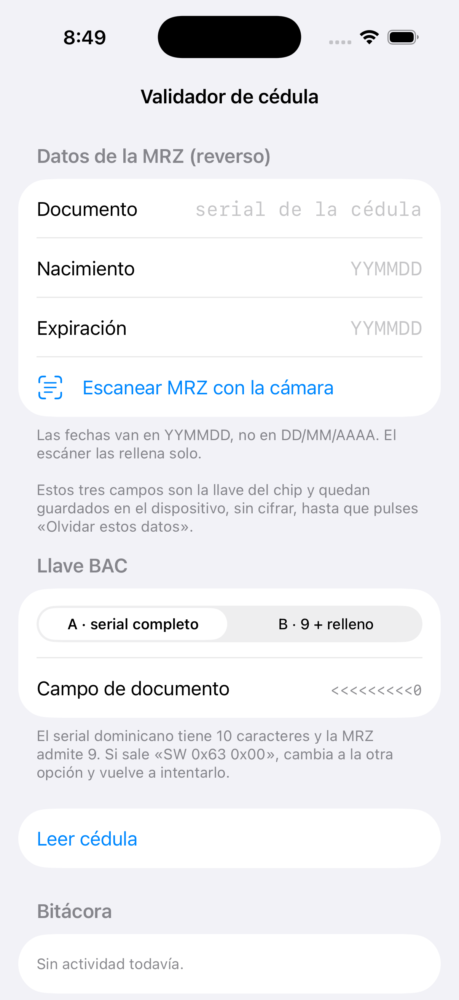

# Guía de la app — pantallas, código y qué hace cada cosa

**Autor: Pablo Holguín**

Recorrido de la app `ValidadorCedula` (iOS): cada pantalla, el código fuente que la
implementa y una explicación de todo lo que puede hacer. Las capturas de las pantallas
posteriores a la lectura (autenticidad, titular, decisión) necesitan una **cédula física**
—el simulador no tiene NFC—, así que esas se documentan con su código y su descripción.

---

## Pantalla principal



Es el punto de entrada. De arriba abajo:

- **Datos de la MRZ (reverso):** los tres campos que forman la llave del chip — documento,
  nacimiento, expiración. Empiezan vacíos (no se guarda ningún dato en el código) y, una vez
  escritos, quedan en el dispositivo hasta pulsar «Olvidar estos datos».
- **Escanear MRZ con la cámara:** OCR de la MRZ con Vision para rellenarlos solos.
- **Llave BAC · A/B:** el conmutador entre las dos formas de armar la llave (el serial
  dominicano tiene 10 caracteres y el campo ICAO admite 9). Muestra en vivo cómo queda el
  campo de documento.
- **Leer cédula:** arranca la sesión NFC.
- **Bitácora:** registro de lo que va pasando, con la traza cruda desplegable.

---

## Fase 1 · Leer el chip

**Qué hace:** deriva la llave de la MRZ, establece PACE y lee nueve grupos de datos en ~4 s.

La derivación de la llave (el detalle fino de la cédula dominicana) vive en `LlaveMRZ.swift`:

```swift
// Arma la llave: documento + dígito, nacimiento + dígito, expiración + dígito.
static func construir(documento: String, nacimiento: String,
                      expiracion: String, opcion: OpcionLlave) -> String {
    let (campo, digito) = campoDocumento(documento, opcion: opcion)
    let nac = rellenar(nacimiento, hasta: 6)
    let exp = rellenar(expiracion, hasta: 6)
    return campo + digito
        + nac + digitoControl(nac)
        + exp + digitoControl(exp)
}
```

La lectura, en `CedulaReader.swift` (único punto de contacto con la librería):

```swift
let documento = try await lector.readPassport(
    mrzKey: llave,
    tags: [.COM, .SOD, .DG1, .DG2, .DG7, .DG11, .DG12, .DG13, .DG14, .DG15],
    customDisplayMessage: mensajeEnPantalla
)
ultimoDocumento = documento
autenticidad = AutenticidadPasiva.verificar(documento)   // Fase 2, en el acto
datos = convertir(documento)
```

**Resultado en pantalla:** foto del DG2, nombre, cédula nacional, serial, lugar de
nacimiento, fecha de emisión, firma manuscrita, y la MRZ cruda desplegable.

---

## Fase 2 · Autenticidad (¿es genuina?)

**Qué hace:** verifica la cadena de confianza. Dos eslabones se comprueban siempre
(datos→SOD y firma del SOD); el tercero (raíz CSCA) es un **hueco configurable**.

`AutenticidadPasiva.swift` traduce las banderas de la librería a un veredicto:

```swift
static func verificar(_ documento: NFCPassportModel) -> ResultadoAuth {
    let csca = urlCSCA
    documento.verifyPassport(masterListURL: csca)
    let integridad = documento.passportDataNotTampered
    let anclada = documento.passportCorrectlySigned
    let veredicto: VeredictoAutenticidad
    if !integridad            { veredicto = .manipulada }
    else if anclada           { veredicto = .genuina }
    else if csca != nil       { veredicto = .emisorNoReconocido }
    else                      { veredicto = .integraSinAnclar }
    return ResultadoAuth(integridad: integridad, firmaAncladaCSCA: anclada,
                         habiaCSCA: csca != nil, veredicto: veredicto)
}
```

**Pantalla:** un banner con el veredicto (🟢 genuino / 🟠 íntegro sin anclar / 🔴 manipulado),
cuatro sellos (PACE, Chip Auth, integridad, firma del emisor) y una fila para **importar el
CSCA (.pem)**. Al importarlo, reverifica sin releer la cédula y el veredicto salta a genuino.

Hoy, con una cédula real y sin CSCA, da **«Íntegro · falta anclar al emisor»** — la verdad
exacta.

---

## Fase 3 · Titular (¿es quien la presenta?)

**Qué hace:** compara un selfie en vivo contra la foto del chip, con control de vida.

Es el **máximo local**: emparejamiento con Core ML y liveness con ARKit + TrueDepth. El
comparador es un **hueco enchufable** (`ComparadorFacial`) — hoy Core ML si hay modelo, o
Vision (orientativo) si no.

Liveness real con profundidad 3D y retos, en `LivenessARKit.swift`:

```swift
// Geometría 3D rastreada de forma estable = señal de profundidad (foto plana no lo logra).
framesConCara += 1
if framesConCara > 15 { profundidadVista = true }

switch reto {
case .parpadeo: superado = v(.eyeBlinkLeft) > 0.55 && v(.eyeBlinkRight) > 0.55
case .boca:     superado = v(.jawOpen) > 0.45
}
```

Emparejamiento con embeddings faciales, en `ComparadorCoreML.swift`:

```swift
let sim = max(0, Double(coseno(ea, eb)))   // distancia coseno entre embeddings
return ResultadoFacial(caraEnSelfie: true, caraEnReferencia: true, puntuacion: sim,
                       umbral: umbral, livenessComprobado: false, aptoProduccion: true, ...)
```

**Pantalla:** botón «Verificar titular» → abre la cámara ARKit, pide retos (parpadea, abre la
boca), confirma profundidad 3D, captura un fotograma y da una puntuación de similitud. Marca
honestamente si el liveness/matching es de producción o orientativo.

> Una foto o una pantalla son planas → no generan geometría 3D estable ni parpadean a demanda
> → **fallan**. Deja claro en el pie que no está certificado (iBeta/ISO 30107-3).

---

## Fase 4 · Decisión + constancia

**Qué hace:** junta los tres controles en un semáforo único y genera una constancia mínima
conforme a la Ley 172-13.

`DecisionFinal.swift` agrega los veredictos (un rojo manda; ámbar/gris = revisar; todo verde
= aprobado) y calcula la vigencia offline desde la fecha de la MRZ:

```swift
if estados.contains(.rojo)                                   { global = .rojo;  titulo = "Rechazado" }
else if estados.contains(.ambar) || estados.contains(.gris) { global = .ambar; titulo = "Revisar" }
else                                                        { global = .verde; titulo = "Aprobado" }
```

La constancia no guarda foto ni biometría — solo la decisión, una referencia enmascarada y
el consentimiento:

```
CONSTANCIA DE VERIFICACIÓN DE IDENTIDAD
Referencia : 224-•••••21-3
Resultado  : REVISAR
Controles:  Genuina REVISAR · Titular n/d · Vigencia OK
Consentimiento del titular: SÍ
```

**Pantalla:** semáforo grande, las tres filas de control con su estado, un toggle de
consentimiento (obligatorio) y el botón «Generar constancia».

---

## Herramienta extra · Exploración del chip

Bajo la bitácora hay una sección de reingeniería que manda **APDUs crudos** (al margen de la
librería) para mapear la tarjeta:

- **Explorar el chip:** lee el `EF.DIR` y descubre los cinco applets; recorre el PKCS#15.
- **Reconocer PIN (sin consumir intentos):** encuentra la referencia del PIN con `VERIFY`
  vacío, sin descontar.
- **Interrogar SSCD (solo lectura):** `GET DATA` sobre el applet de firma.

Todo esto es lo que produjo el mapa de applets y los hallazgos del dossier. No envía ningún
PIN.

---

## Lo que la app **no** hace, a propósito

- **No envía el PIN** para abrir certificados protegidos (riesgo de bloqueo irreversible).
- **No afirma «genuino» sin el CSCA** — dice la verdad («íntegro sin anclar»).
- **No presume de liveness certificado** — marca lo local como no certificado.

Diseño honesto: la app muestra exactamente lo que puede probar, y marca lo que no.
